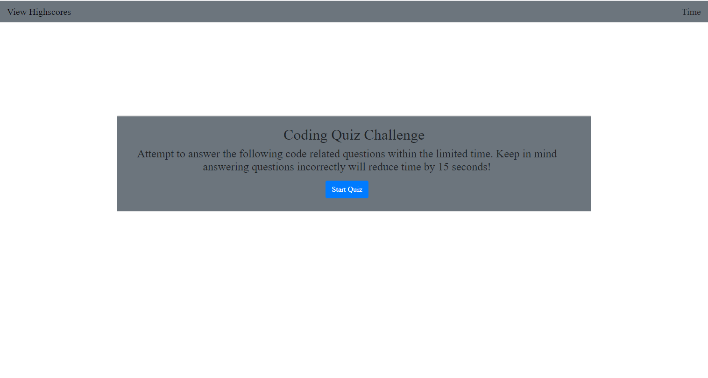

# 04_code_quiz

## Code Quiz Summary

* This is a simple quiz that is tracked by a timer.

* When you start the quiz a timer starts. You are promted with questions.

* If questions are answered incorrectly time is substracted from your timer.

* Your timer is equal to your overall score which can be saved at the end of the quiz.

## Images

## Links

https://sethglenn.github.io/04_code_quiz/04_code_quiz/